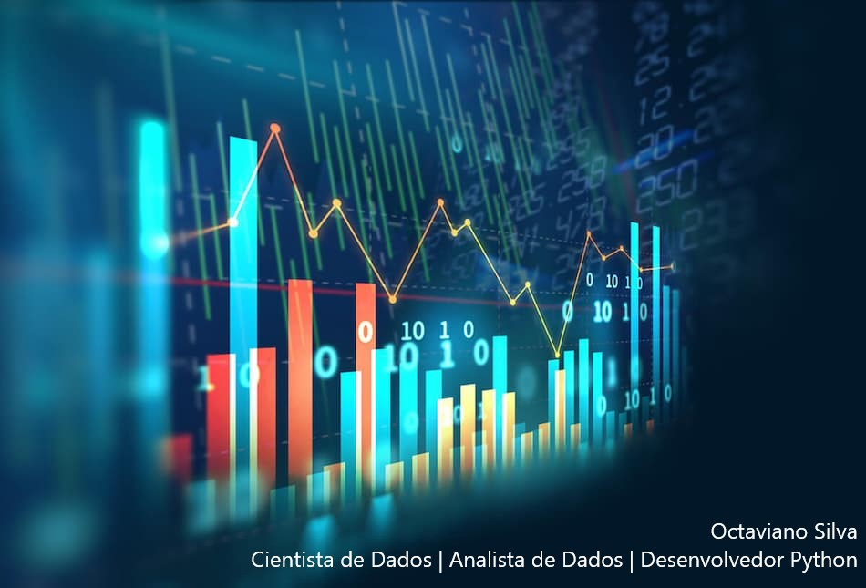

  

# Octaviano Silva
Engenheiro de Controle e Automação e Cientista de Dados

Durante minha graduação na área de tecnologia, me interessei pelo tema **Inteligência Artificial(IA)** e sua vasta aplicação tanto na atualidade quanto no futuro, o que me levou para outro tema bastante recorrente quando se fala de IA, o **Empreendedorismo e Inovação**. Tendo me dedicado mais nas áreas de programação como CLP's, sistemas supervisórios e robótica, agora busco desenvolver uma carreira como **Cientista de Dados**, onde aprenderei a coletar dados, analisá-los e interpretá-los para **Pesquisas de Alta Performance** e para tomada de decisão em **Transformações de Negócios**.

**Background in:** Python, Machine Learning, CLP/PLC, Sistemas Supervisórios.

**Links:**
* [LinkedIn](https://www.linkedin.com/in/octaviano-silva-74a530207/)
* [Medium](https://medium.com/@silv.octaviano)

## Projetos:

* **Analisando dados do Airbnb em Tóquio** https://bityli.com/1klAm
* **Analisando a violência no Rio de Janeiro** https://bityli.com/JG41m
* **Estudo de caso da COVID-19** https://bityli.com/8fbdc
* **Detecção de fraudes em cartões de crédito** https://cutt.ly/SmqFiaA
* **Churn Prediction em Telecomunicações** https://bityli.com/I6hkE
* **Análise de Risco de Crédito** https://bityli.com/NJDJy
* **Deploy de API para previsão de preços de apartamentos na cidade de São Paulo** https://bityli.com/O64Z6T
---

